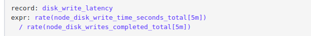
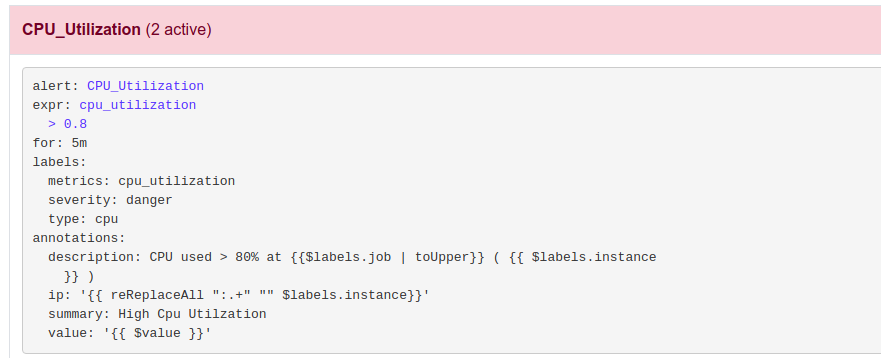
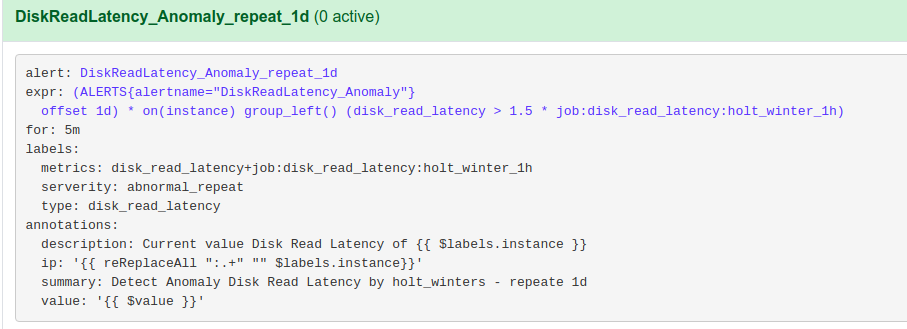
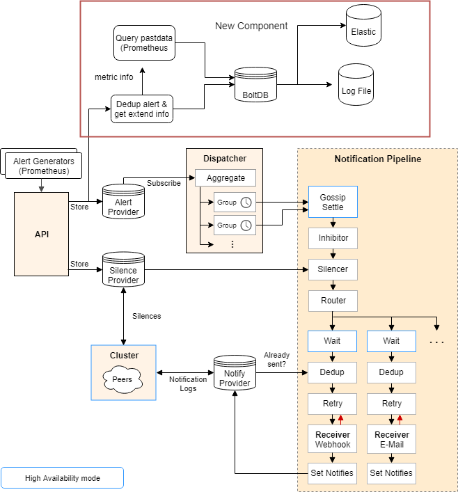
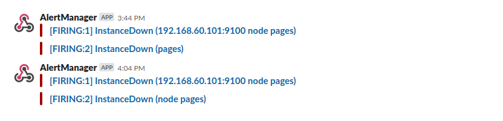
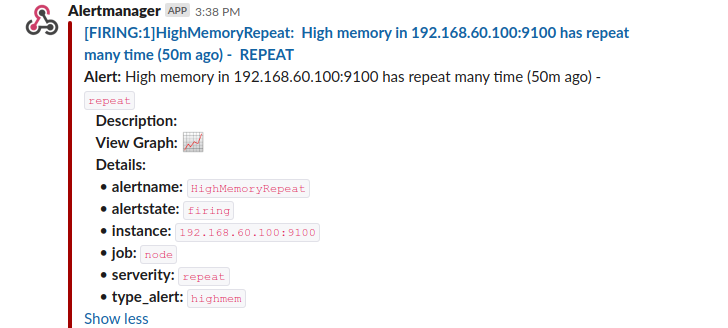

# Alert

1. [Mục tiêu](#mục-tiêu)
2. [Tạo alert](#tạo-alert)
3. [Lưu log các alert](#tạo-log-các-alert)
4. [Template notify](./template-notify)
5. [Alert Lifecycle](#alert-lifecycle)

### Mục tiêu

- Tạo các alert mẫu cho monitor Linux OS
  - Alert theo threshold
  - Alert phát hiện bất thường
  - Alert có điều kiện dữ liệu quá khứ
  - Alert dự đoán tài nguyên sử dụng 
- Xuất log các alert gửi đi vào file log 
- Hiển thị vòng đời của các alert 

### Tạo alert

#### 1. Tạo các record cần thiết cho alert

Do metric lấy thường là các thông tin của hệ thống nguyên bản (Ex: time mode cpu, disk_weight time...) nên để có các metrics mong muốn (cpu utilization, memory saturation) theo như [monitor_method](./linux/README.md) thì cần phải dùng các record để mapping các metrics mong muốn (ex: [disk giống iostat](<https://www.robustperception.io/mapping-iostat-to-the-node-exporters-node_disk_-metrics>). 

Cách thức tạo [record](<https://prometheus.io/docs/practices/rules/>)

#### 2. Tạo alert theo threshold

Các alert cảnh báo giá trị vượt ngưỡng là các alert cơ bản của hệ thống alert và có thể được tạo đơn giản theo các thức tạo [alert](<https://prometheus.io/docs/prometheus/latest/configuration/alerting_rules/>)

#### 3. Tạo alert phát hiện bất thường

[Detect anomaly ](./detect_anomaly.md)

#### 4. Tạo các alert liên quan tới dữ liệu quá khứ

Như trình bày phần trên về các alert anomaly, các alert anomaly có thể giúp phát hiện những điểm đột biến của dữ liệu metrics. Tuy nhiên trong một số trường hợp các đột biến này lặp lại theo 1 chu kì nào đó (backup mỗi ngày, xóa dữ liệu định kì ...) thì việc nhận biết sự lặp lại của các đột biến này là một yếu tố cần thiết để loại bỏ hoặc giảm mức độ cảnh báo của các alert anomaly từ đó giảm thiểu workload. 

Những việc cần thực hiện

- Định nghĩa các alert anomaly repeat

  - Dùng PromQL để truy vấn ALERT có diễn ra trong quá khứ không (offset 1d, 2d ..v) 
  - Expr : anomaly condition + is alert happend in x ago (offset) 

  

- Định nghĩa mức độ cảnh báo cho trường hợp này : 'repeat'

- Dùng chức năng inhibit rules của alertmanager để ghi đè hành động đối với các alert  

  

### Lưu log các alert 

Mặc định Alertmanager không lưu các alert đã gửi đi nên muốn thêm tính năng này cho alertmanager ta thực hiên móc hàm ghi alert vào database tạm (boltDB) vào luồng gửi alert của alertmanager. Tiến trình ghi alert 

1. Khi có alert firing, Prometheus sẽ gọi API (POST) để tạo alerts trên alermanager

2. Alertmanager kiểm tra alert này là mới hay đã tồn tại để insert hoặc update vào list alert trên vùng nhớ 

3. Khi alertmanager update list alert ta móc function ghi alert vào DB. 

4. Các alert ghi vào được tạo 1 hashkey để phân biệt các alert 

5. Xuất ra log file từ DB và lưu vào Elastic để thống kê. 

   

### Template notify 

Alertmanager hỗ trợ nhiều kênh thông báo alert khác nhau: email, slack, pager_durty ... Tuy nhiên với mặc định các notify gửi đi thường không thể hiện nhiều thông tin như alert có thể có được: 

Để notify thể hiện nhiều thông tin ta có thể [tạo template](<https://harthoover.com/pretty-alertmanager-alerts-in-slack/>) cho notify gửi đi:

### Alert Lifecycle

[https://pracucci.com/prometheus-understanding-the-delays-on-alerting.html](https://pracucci.com/prometheus-understanding-the-delays-on-alerting.html)