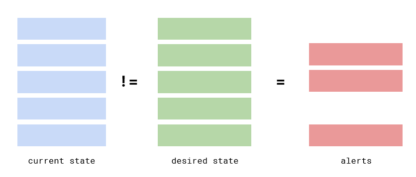
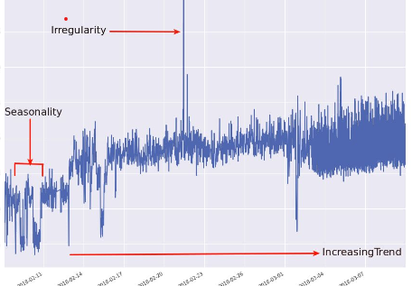
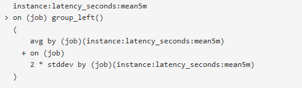
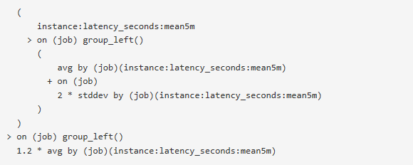
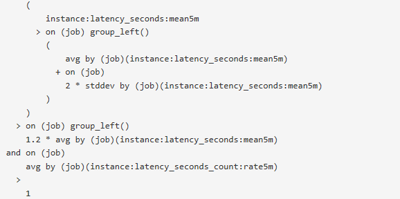
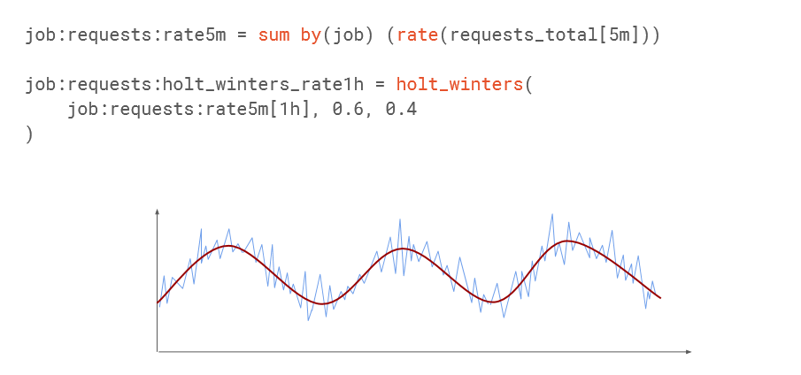
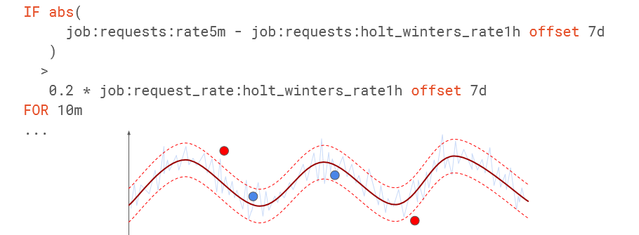
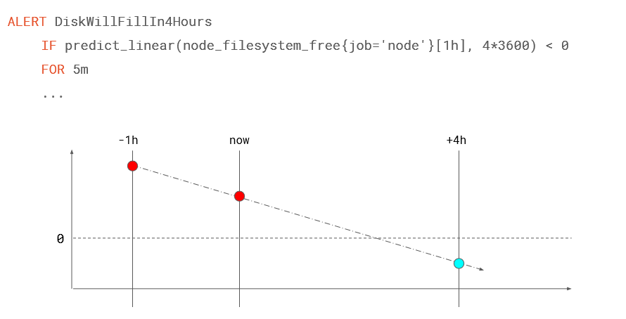

# Detect Anomaly

Dữ liệu bất thường (anomalies) cho chuỗi thời gian (time series) là các điểm dữ liệu ngoại lệ so với các tín hiệu tiêu chuẩn hoặc thông thường (thường được định nghĩa dựa vào mức giới hạn hoặc dữ liệu quá khứ). Vấn đề tìm ra các mẫu này được gọi là phát hiện bất thường. Tầm quan trọng của phát hiện bất thường là do thực tế là sự bất thường trong dữ liệu thường dẫn tới việc xác định được các vấn đề trong hệ thống hoặc hoạt động có thể gây ảnh hưởng tới hệ thống. 

- Ex: theo dõi người dùng tại trang web => thấy sự tăng trưởng bất ngờ của người dùng trong một khoảng thời gian ngắn trông giống như một đột biến => Bất thường do dữ liệu vượt biên (mức độ bình thường) 
- máy chủ của bạn ngừng hoạt động và có số lượng người dùng thực sự thấp hoặc =0 trong một khoảng thời gian ngắn.

**#Components of Time Series**

- ***Trend:*** Sự tăng hay giảm giá trị chuỗi thời gian trong 1 khoảng thời gian
- ***Seasonality:*** Mẫu (pattern) dữ liệu tăng hay giảm có sự lặp lại theo thời gian ngắn hạn
- ***Cyclicity:***  Biến đổi trong khoảng thời gian dài hạn, lặp lại ko đều 
- ***Irregularity:*** Những biến đổi ko đoán trước được và có thể ko lặp lại 

​        

eries

=> Từ những bộ phận của time series ta xây dựng các cách tiếp cận khác nhau cho việc tìm kiếm bất thường của dữ liệu 

 

**1.Phát hiện bất thường theo rule**

Có nhiều dị thường phổ biến mà bạn có thể phát hiện và xử lý chỉ với các rule được xây dựng tùy chỉnh. Ngôn ngữ truy vấn Prometheus cung cấp các function để xây dựng các rule tùy chỉnh sâu để tránh và hạn chế các báo động giả (false positives). 

**##Kịch bản**  

Xây dựng rule alert về độ trễ của request (1 instance): ***instance:latency_seconds:mean5m*** với điều kiện:

  `( độ trễ (instance)> 2 * độ lệch độ chuẩn ( Standard deviation) + avg(job) độ trễ)`

(Mean:  Đưa ra alert khi độ trễ của 1 instance lớn hơn độ trễ tb của các instance trên cùng 1 job khoảng cách 2x độ lệch chuản của độ trễ tb )

​                

- Tuy nhiên khi áp dụng ta thấy có nhiều báo động giả khi độ trễ là chỉ số nhỏ (tuy nhiên độ lệch lớn) nên thêm điều kiện nên lệch > 20% 

​                

- Tiếp theo lại thấy sẽ có báo động giả xảy ra khi lượng request thấp ( vì đang tính theo khung thời gian ) nên sẽ thêm điều kiện nên có ít nhất 1 request/s

​              

Như thế ta đã có được 1 rule alert khi có bất thường và hạn chế được nhiều trường hợp báo động giả. 

**'\*'** Ngoài ra có thể loại bỏ 1 số tính báo động giả dựa vào cú pháp ***'For'***, hạn chế được các báo động giả tức thời -> chỉ là nhất thời, ko cần xem xét ngay. ( trễ 1 vài phút sẽ ko ảnh hưởng lớn tới việc khắc phục sự cố xảy ra trên thực tế _ )

**## Phát hiện bất thường với khả năng dự đoán**  (Holt-winter)

Prometheus có hỗ trợ hàm [holt-winter](https://en.wikipedia.org/wiki/Exponential_smoothing) trong xử lý truy vấn, có thể được áp dụng để đưa ra dự đoán dự theo xu hướng của dữ liệu hiện tại. 

**Ex** Dùng holt-winter tạo ra biên độ dao động cho chuỗi dữ liệu thời gian đang xem xét và cố gắng dịch chuyển theo xu hướng cho tương lai ( offset) 

Những điểm bất thường là những điểm nằm ngoài biên so với grep của holt-winter đã tạo ra. 

**#Predict** 

Prometheus hỗ trợ function ***predict_linear()*** thực hiện giải thuật ***linear regression*** . để đưa ra dự đoán về time series dựa theo dữ liệu quá khứ.  chỉ nên áp dụng predict_linear cho kiểu dữ liệu Gauge

predict_linear phù hợp cho dự đoán các metric liên quan tới: 

- #### Capacity Planning

- Resource utilization

Ex: Cảnh báo disk sẽ full trong 4h tiếp theo. 

-  Thực hiện predict với khoảng thời gian 1h trước cho tới thười điểm hiện tại. 

