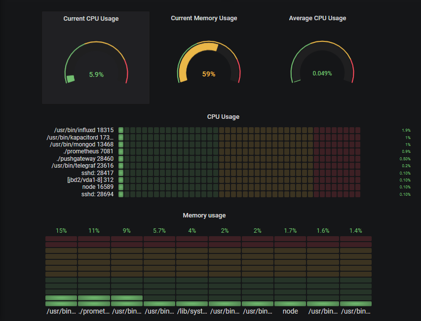
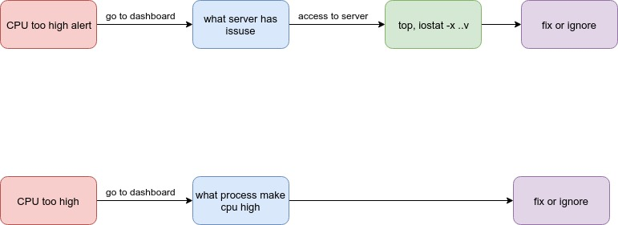

# Hướng phát triển 

### 1. Monitor chi tiết process 

- **Goal:** Có nhận biết về tiến trình nào gây nên problem cho cpu, mem ... mà không cần ssh vào server cụ thể 

  Ex: dashboard

  

WorkFlow: 

[article detail](https://medium.com/schkn/monitoring-linux-processes-using-prometheus-and-grafana-113b3e271971)

### 2. Service Discovery 

- Merge export có features tạo ra file config : ip , exporter có trên instance
- Crontab để update file config vào storage tập trung
- Cấu hình prometheus nhận file config từ storage 

