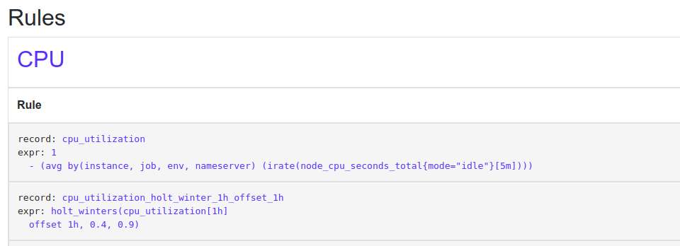

# Prometheus

### Index

1. [Kiến trúc tổng quan](#kiến-trúc-tổng-quan)
2. [Data model](#data-model)
3. [Instrumentation](#Instrumentation)
4. [Service Discovery](#service-discovery)
5. [Storage](#storage)
6. [Recording Rules and Alerts](#recording-rules-and-alerts)

Có một số hệ thống giám sát khác nhau nhưng không tất cả đều phù hợp đối với các hệ thống lớn và phân tán.

Black box monitoring như Nagios cho phép kiểm tra xem ứng dụng còn hoạt động và bình thường. Nó thực hiện  bằng việc ping hệ thống, xem xét không gian đĩa hoặc CPU usage. Nhưng trong bối cảnh hệ thống phân tán, nơi tính sẵn sàng và khả năng phản hồi là chìa khóa thì việc chỉ kiểm tra hệ thống còn alive không là chưa đủ. Phải biết được một service nội bộ có hoạt động tốt hay không. Nó đang tiếp nhận bao nhiêu request ? tốc độ phản hồi ? Bao nhiều lỗi được ghi log lại...


Prometheus là một hệ thống giám sát white box  dựa trên số liệu (metrics) mã nguồn mở


**Sức mạnh :**

- Mô hình dữ liệu đa chiều với chuỗi dữ liệu thời gian được xác định bởi cặp số liệu khóa- giá trị
- Ngôn ngữ truy vấn PromQL linh hoạt tận dụng sức mạnh của dữ liệu đa chiều
- Khả năng monitor phân tán thích hợp với các hệ thống cloud
- Dễ mở rộng và không tập trung
- Có thư viện các ngôn ngữ lập trình: Python, Go, Java .. để mở rộng hệ thống

### Kiến trúc tổng quan

###**Kiến trúc**

- Prometheus server scrape (pull) [metrics](<https://medium.com/@copyconstruct/logs-and-metrics-6d34d3026e38) từ các đối tượng giám sát hoặc các push gateway - nơi mà các đối tượng push metrics lên đó.
- Prometheus lưu trữ local không phân tán

- Prometheus sẽ thực hiện các rule lên dữ liệu, **tạo các time series**  hoặc **trigger các alert**
- Server cũng cung cấp các API để truy vấn hoặc có thể sử dụng grafana để thực hiện Dashboard
- Prometheus nhận biết các đối tượng cần giám sát thông qua cấu hình tĩnh (cấu hình trước khi chạy) hoặc service **discovery**


**instance**: Mỗi đối tượng endpoint thu thập dữ liệu (scrape)

**jobs**: tập hợp các instance có chung mục đích như chạy cùng 1 service


### Data Model

Prometheus lưu trữ dữ liệu dưới dạng chuỗi thời gian [time series](<https://blog.timescale.com/what-the-heck-is-time-series-data-and-why-do-i-need-a-time-series-database-dcf3b1b18563/>) . Chuỗi thời gian là luồng các giá trị theo **timestamp** của các giá trị được đánh dấu cùng **một label hoặc metrics**. Label cũng chính là điều tạo nên khả năng đa chiều các dữ liệu trong Prometheus ( phân chia theo host, machine, service ...)


Ví dụ: muốn giám sát được số lượng HTTP request trên API, chúng ta có thể tạo metric **api_http_request_total.** Để metric trở nên đa chiều ta sử dụng các label. Label thực chất chỉ là các giá trị key-value. Trong trường hợp này ta có thể thêm label **method** để nhận HTTP method làm giá trị trong metric mới của chúng ta. Hoặc có thêm label endpoint được gọi ở API hoặc HTTP status code cho request là label.

kí hiệu cho một metric được tạo như trên có thể là:

```
`api_http_requests_total{method="GET", endpoint="/api/posts", status="200"}`
```

Một trong những điểm tuyệt vời của dữ liệu chuỗi thời gian là nó được tạo ra không phụ thuộc vào số lượng sự kiện. Mặc dù máy chủ có thể có số lượng sự kiện (trong trường hợp trên là số request lên API) thì số lượng chuỗi thời gian được tạo ra vẫn giữ nguyên. Chỉ có giá trị ban đầu là khác nhau. Điều này sẽ giúp việc mở rộng hệ thống dễ dàng hơn.


Prometheus đưa ra 4 loại giá trị metrics để hỗ trợ tạo một hoặc nhiều chuỗi thời gian:

- **Counter :** Biểu diễn giá trị chỉ tăng, như bộ đếm như đếm số request, tổng số kết nối xử lý, tổng số lỗi xảy ra

- **Gauge :** Biểu diễn 1 giá trị như Counter tuy nhiên giá trị này có thể tăng giảm với các method inc, dec, set. Nó như snapshot của 1 thông số tại 1 thời điểm : số lượng process đang xử lý, số lượng kết nối đnag đợi ...

- **Histogram:** Thực chất là một biểu đồ tích lũy, Histogram tạo bộ đếm cho số lượng sự kiện, bộ đếm cho tổng sự kiện và bộ đếm cho mỗi bucket. Buckets sẽ đếm xem các giá trị bé hoặc lớn hơn giá trị của bucket (trong Prometheus thường là bé hơn "le" )

- - Có thể tính toán percentitles từ histogram bằng function  histogram_quantile

- **Summary:** Giống nhứ hàm  histogram_quantile  nhưng percentitles được tính toán ở client . nó cũng tạo bộ đếm *count và sum* nhứ histogram và cho ra kết quả.

### Instrumentation

Phần khả năng về tạo công cụ đo đạc là một lơi thế rất lớn của Prometheus. Prometheus cung cấp khả năng đo đạc (lấy các thông số ) bằng các công cụ xuất trực tiếp (node, database) hoặc các thư viện ngôn ngữ như: Python, go, Ruby ...


**Cách tiếp cận sử dụng Instrumentation**

Khi instument, nên cân nhắc xem là instrument service hoặc libraries (thư viện )

**# Service Instumentation:**

- **online-serving systems:**  Các dịch vụ có người dùng hoặc service khác đợi phản hồi: web server, databases ..

- - \>Thông thường các dịch vụ này thường có các metrics theo nguyên tắc **RED ( Request, Error, Duration )**

- **offline-serving systems:** Các dịch vụ này không cần phải phản hồi ngay lập tức. Chúng thường tham một hàng đợi công việc: xử lý log . Cho mỗi trạng thái nên có metrics về: lượng công việc trong hàng đợi, công việc đang tiến hành, tốc độ xử lý tiến trình,, lỗi xảy ra. USE method ( Utilisation, Saturation, Error,)

- - Utilisation: Lượng công việc đang phải xử lý  ( processing)
  - Saturation: Lượng công việc còn lại đang đợi ( waiting )
  - Error: Lỗi

- **batch jobs:** cũng giống như offline-serving nhưng batch-job chạy theo chu kí còn offline-serving chạy liên tục. Do batch jobs không chạy liên tục nên scrape không hoạt động tốt lắm, nên kỹ thuật nên dùng là **Pushgateway.** Khi kết thúc batch-jobs nên nên có metrics: how long it took to run ? how long each stage of job took ? time job succeed ? Alert when failed .

**# Library  instrumentation**

Libraries liên quan tới các mini services: functions, method, cho phép tính toán các thông tin ở mức độ backend


**# How much instrumentation**

Prometheus có thể xử lý hàng triệu metrics và hàng ngàn app instances. 1 metrics đơn mới chỉ cần khoảng 0,01 % khả năng của Prometheus để xử lý nhừng một "cardinality" metrics trên hàng trăm instances có thể làm tiêu hao tới 1 % resources Prometheus.


### Service Discovery

Khi các exporter monitor đã được cài đặt, Prometheus cần phải biết các exporter ở đâu ? để tiến hành scrape metrics và có thể thông báo tình trạng sẵn sàng của exporter đó thông qua việc truy vấn tới. Với môi trường mạng ổn định, có thể 1 list danh sách địa chỉ các instance đủ để Prometheus scape dữ liệu. Nhưng với các môi trường mạng động: docker, kubernetes , aws, .. thì cần có service discovery để cung cấp cơ chế cho Prometheus cập nhật thông tin các exporter trong mạng một cách tự động.

Prometheus có hỗ trợ Service Discovery cho EC2, Kubernetes, Consul, Azure .. hoặc có thể tự tạo [custom Service Discovery ](<https://prometheus.io/blog/2018/07/05/implementing-custom-sd/>)

### Storage

Prometheus lưu trữ dữ liệu lên ổ đĩa local trong cơ sở dữ liệu tùy chỉnh (PromQL) có dạng TSDB(time series database). Độ tin cậy là một thách thức của hệ thống phân tán do đó để duy trì tín tin cậy cao (reliable) Prometheus vẫn chưa hỗ trợ kiến trúc phân tán chính thức. Ngoài ra việc không phân cụm giúp việc chạy các Prometheus dạng binary dễ dàng không phụ thuộc vào các thành phần bên ngoài. Từ lúc phát triển tới nay, cơ chế lưu trữ luôn là phần được chú trong trong Prometheus. Hệ thống lưu trữ được tối ưu để có thể lưu trữ và xử lý hàng triệu mẫu dữ liệu mỗi giây, tương đương hàng chục nghìn exporter trên thực tế, với mỗi mẫu dữ liệu chỉ tốn 1,3 byte. thực tế. [tham khảo](<https://coreos.com/blog/prometheus-2.0-storage-layer-optimization>)
### Recording Rules and Alerts

Mặc dù Prometheus hỗ trợ ngôn ngữ truy vấn PromQL mạnh mẽ và cơ chế lưu trữ tối ưu nhưng việc tổng hợp, tính toán và xuất giá trị của hàng triệu metric có thể chậm hơn bình thường (so với dữ liệu metric raw chỉ cần query) do đó cần có các record rules. Các record rule như một bản ghi biểu thức thực hiện thao tác với các metrics để lấy kết quả (có thể coi như 1 metric mới được tạo ra) , với việc định nghĩa trước biểu thức việc tính toán của Prometheus sẽ nhanh hơn.



Alerts rule là một dạng record rule đặc biệt khi mà kết quả của biểu thức sẽ là cơ sở để tạo alert của Prometheus gửi đi alertmanager


