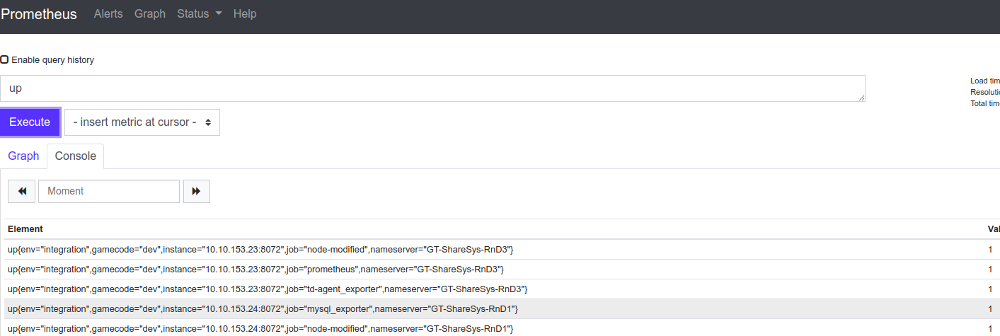

# Truy vấn (PromQL) #

1. [Is the system running?](./#q001)
2. [HTTP status codes rate](./#q002)
3. [Average response time](./#q003)
4. [Slowest 5 requests (average)](./#q004)
5. [More called endpoints](./#q005)
6. [CPU used per minute group by instance](./#q006)
7. [Request total per minute by instance](./#q007)
8. [Used memory (MB)](./#q008)
9. [Free memory (percentage 0-100)](./#q009)

## Tổng quan

Prometheus hỗ trợ ngôn ngữ PromQL để thực hiện truy vấn với Prometheus. Các truy vấn có thể dùng để tạo các biểu thức cho record rule hoặc có thể chỉ là các truy vấn ad-hoc trên WebUI của Prometheus để phân tích thông tin monitor. Xem chi tiết về truy vấn [PromQL](<https://www.slideshare.net/weaveworks/promql-deep-dive-the-prometheus-query-language>)

​												Giao diện web query

###### Q001

### Is the system running?
`up{instance="<instance_tag>"}`

###### Q002
### HTTP status codes rate
`sum(http_server_requests_total{code=~"4..", instance="<instance_tag>"}) / sum(http_server_requests_total{instance="<instance_tag>"})`

*Note: 4.. in the code pattern can be replaced with different numbers.*

###### Q003
### Average response time
`sum(http_server_request_duration_seconds_sum) / sum(http_server_request_duration_seconds_count) * 1000`

###### Q004
### Slowest 5 requests (average)
`topk(5, http_server_request_duration_seconds_sum / http_server_request_duration_seconds_count * 1000)`

###### Q005
### More called endpoints
`topk(10, http_request_total or http_requests_total or http_server_requests_total)`

###### Q006
### CPU used per minute group by instance
`sum(rate(process_cpu_seconds_total{}[1m])) by (instance)`

###### Q007
### Request total per minute by instance
`sum(rate(http_requests_total[1m])) by (instance)`

###### Q008
### Used memory (MB)
`(node_memory_bytes_total - node_memory_free_bytes_total) / 1024 /1024`

###### Q009
### Free memory (percentage 0-100)
`node_memory_free_bytes_total / node_memory_bytes_total * 100.0`
